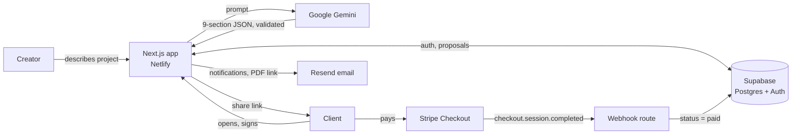

# ProposalAI

Describe a project, get a full client proposal written for you in seconds, then send one link where the client reads it, signs it, and pays.

**Live demo:** https://proposal-genai.netlify.app

## What it does

- **AI-written proposals.** Google Gemini turns a short project description into nine sections: executive summary, challenge, solution, scope, timeline, investment, why us, terms and next steps. The model's JSON is validated before it is saved.
- **Edit before you send.** Every section is editable while the proposal is a draft or sent.
- **Email it to the client.** A "Send to client" button emails the proposal link to the address on the proposal, with your address as Reply-To. "Gmail draft" opens a pre-filled Gmail compose window instead and needs no setup.
- **One shareable link.** Clients need no account. The page records when it was opened (ignoring bots and link-preview crawlers, and your own previews) and emails you the first time.
- **E-signature.** The client draws a signature, which is stored with the proposal and printed on the PDF.
- **Stripe payment.** After signing, the client pays the proposal amount through Stripe Checkout. A webhook marks the proposal paid.
- **PDF export.** Download the signed proposal as a PDF, generated on request.
- **Branding and admin.** Add your company name, logo and brand color. Admins can see and manage all users.

## How it works



Proposal status moves `draft → sent → viewed → signed → paid`. The creator can only toggle `draft ⇄ sent`; later steps are set by the client-facing flows and Stripe, and signed or paid proposals are read-only. The rules are enforced in the API and again by a database trigger.

## Tech stack

| Area | Choice |
| --- | --- |
| App | Next.js 14 (App Router), React 18, TypeScript |
| Styling | Tailwind CSS, Radix UI primitives |
| Data and auth | Supabase (Postgres, Row Level Security, Auth) |
| AI | Google Gemini (`@google/generative-ai`) |
| Payments | Stripe Checkout and webhooks |
| Email | Resend |
| PDF | `@react-pdf/renderer` |
| Validation | zod |
| Tests and CI | Vitest, GitHub Actions |
| Hosting | Netlify (`@netlify/plugin-nextjs`) |

## Getting started

You need Node 20+, a [Supabase](https://supabase.com) project, a free [Google AI Studio](https://aistudio.google.com) key, a [Stripe](https://dashboard.stripe.com) account (test mode is fine) and a [Resend](https://resend.com) key.

```bash
git clone https://github.com/itsDarrends/proposal-ai-generator.git
cd proposal-ai-generator
npm install
cp .env.local.example .env.local   # then fill in the values
```

Run the SQL files in `supabase/migrations/` in order, in the Supabase SQL editor. Run `004_security_hardening.sql` after the matching app code is deployed, and `005_email_send_tracking.sql` before the "Send to client" code is.

```bash
npm run dev     # http://localhost:3000
```

### Environment variables

| Variable | Purpose |
| --- | --- |
| `NEXT_PUBLIC_SUPABASE_URL`, `NEXT_PUBLIC_SUPABASE_ANON_KEY` | Supabase project |
| `SUPABASE_SERVICE_ROLE_KEY` | Server-only key for public pages and webhooks. Never expose it. |
| `GOOGLE_AI_API_KEY` | Gemini |
| `STRIPE_SECRET_KEY`, `NEXT_PUBLIC_STRIPE_PUBLISHABLE_KEY`, `STRIPE_WEBHOOK_SECRET` | Stripe |
| `RESEND_API_KEY` | Resend |
| `EMAIL_FROM` | Sender address. Required in practice for "Send to client": Resend only delivers to your own address until you verify a domain. |
| `EMAIL_DNS_CHECK` | Optional. Set to `off` to skip the mail-server DNS lookup on client addresses. |
| `NEXT_PUBLIC_APP_URL` | Your site's URL, no trailing slash. Used in every email link and Stripe redirect. |
| `MOCK_AI`, `MOCK_EMAIL`, `MOCK_PAYMENT` | Optional dev switches (`true` to skip the real service). `MOCK_PAYMENT` is ignored in production. |

### Stripe webhook

Create a webhook for `https://<your-site>/api/stripe/webhook` listening for `checkout.session.completed` and put its signing secret in `STRIPE_WEBHOOK_SECRET`. To test locally: `stripe listen --forward-to localhost:3000/api/stripe/webhook`.

### Making yourself an admin

```sql
UPDATE profiles SET role = 'admin' WHERE email = 'you@example.com';
```

## Scripts

```bash
npm run lint        # ESLint
npm run typecheck   # tsc --noEmit
npm test            # Vitest: status rules, validation, webhook, signing, views
npm run build       # production build
```

CI runs all four on every push to `master` and on pull requests.

## Security notes

- Row Level Security is on for `profiles` and `proposals`. Signed-in users can edit only their name and branding; `role` can't be changed from the client.
- Public proposal pages and webhooks use a service-role client that has no user session, so row security never depends on who is browsing.
- The Stripe webhook verifies the signature, requires `payment_status = paid` and a matching amount, and updates conditionally so retries are safe.
- Card details never touch this app; payment happens on Stripe's hosted page.
- Proposal generation is rate limited per user.
- Client email addresses are checked for format, typos (`gmial.com`), throwaway domains, and whether the domain can receive mail. Sending uses only the address saved on the proposal, with a cooldown and a per-proposal cap.

## Deploying on Netlify

Connect the repo and set the environment variables above. Netlify builds the `master` branch on every push. Variables beginning with `NEXT_PUBLIC_` are read at build time, so redeploy after changing one.

On Netlify's free plan a function is stopped after about 10 seconds, so generation uses Gemini's fast "lite" models and gives up after 8.5 seconds with a retry message.

## License

MIT

## Contact

[itsdarrendsilva@gmail.com](mailto:itsdarrendsilva@gmail.com)
